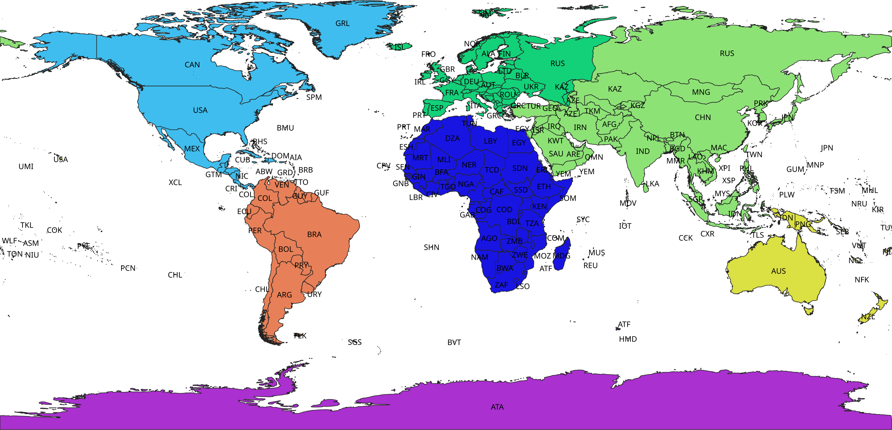

= Continents

This repository contains a http://www.geopackage.org/spec/[GeoPackage] of a set of polygons suitable for constructing a 7-continent layer from terrestrial polygons.

.The "Continent Cookie Cutter" polygons, to intersect with a set of global, terrestrial polygons

For example, https://www.naturalearthdata.com/[Natural Earth], https://www.openstreetmap.org/[OpenStreetMap] or https://gadm.org/[GADM] polygons can be intersected with these polygons to derive the continents:

.GADM Level 0 polygons split using these polygons

They are intended for use indexing occurrences in https://www.gbif.org/[GBIF.org].

== Boundaries

Refer to https://en.wikipedia.org/wiki/Boundaries_between_the_continents_of_Earth[Boundaries between the continents of Earth] for a general background, to the http://www.tdwg.org/standards/109[World Geographical Scheme for Recording Plant Distributions (WGSRPD)] to justify some decisions on where to group islands, and to the polygons themselves.

The boundaries are drawn carefully across land, but roughly across the sea. *These polygons are not intended to represent accurate maritime boundaries!* Continents are landmasses, so the marine boundaries are not important, except as they include or exclude islands from the continents.

The boundaries are as follows:

=== Africa:

Clockwise from Egypt, the terrestrial border with Asia follows the Isthmus of Suez, using the western channels of the https://www.openstreetmap.org/relation/7719838[Suez Canal from OSM].

The marine boundary roughly follows the maritime boundaries through the Gulf of Suez, with the Yemeni island of https://en.wikipedia.org/wiki/Socotra[Socotra] in Africa.

The https://en.wikipedia.org/wiki/Seychelles[Seychelles], https://en.wikipedia.org/wiki/Mairitius[Mauritius] and https://en.wikipedia.org/wiki/Comoros[Comoros] are grouped with Africa.

The https://en.wikipedia.org/wiki/Scattered_Islands_in_the_Indian_Ocean[Scattered Islands in the Indian Ocean] between the African mainland and Madagascar are grouped with Africa, the others in Antarctica.

The https://en.wikipedia.org/wiki/Prince_Edward_Islands[Prince Edward Islands] of South Africa are assigned to Antarctica.

https://en.wikipedia.org/wiki/Tristan_da_Cunha[Tristan da Cunha], https://en.wikipedia.org/wiki/Saint_Helena[Saint Helena] and https://en.wikipedia.org/wiki/Ascension_Island[Ascension ]islands are grouped with Africa.

The https://en.wikipedia.org/wiki/Canary_Islands[Canary] and https://en.wikipedia.org/wiki/Madeira[Madeira] islands are grouped with Africa.

https://en.wikipedia.org/wiki/Ceuta[Ceuta] and https://en.wikipedia.org/wiki/Melilla[Melilla] are on the African mainland, and include nearby islands

https://en.wikipedia.org/wiki/Malta[Malta], the Italian island of https://en.wikipedia.org/wiki/Lampedusa[Lampedusa] and the Spanish islet of https://en.wikipedia.org/wiki/Alboran_Island[Alboran Island] are grouped with Europe.

=== Asia:

Continuing from Egypt at the Suez Canal, clockwise.

https://en.wikipedia.org/wiki/Cyprus[Cyprus] is part of Asia, along with most of https://en.wikipedia.org/wiki/Turkey[Turkey] and the western https://en.wikipedia.org/wiki/Aegean_Islands[Aegean Islands] of Greece.

The border continues through the https://en.wikipedia.org/wiki/Black_Sea[Black Sea] and follows the crest line of the https://en.wikipedia.org/wiki/Caucasus[Caucasus] and crosses the https://en.wikipedia.org/wiki/Caspian_Sea[Caspian Sea] to the mouth of the Ural River.  This part of the border is taken from a dataset produced by https://sashamaps.net/docs/resources/europe-asia-boundary/[Sasha Trubetskoy].

The border follows the https://en.wikipedia.org/wiki/Ural_River[Ural River] (from https://www.openstreetmap.org/relation/214415[OpenStreetMap]) as far as the source at https://en.wikipedia.org/wiki/Bashkortostan[Bashkortostan]–https://en.wikipedia.org/wiki/Chelyabinsk_Oblast[Chelyabinsk] Oblasts' borders.

Trubetskoy's line then continues, following the https://en.wikipedia.org/wiki/Ural_Mountains[Ural Mountains] to the https://en.wikipedia.org/wiki/Kara_Sea[Kara Sea].

The Russia/USA border follows the national boundaries, including the separation of the https://en.wikipedia.org/wiki/Diomede_Islands[Diomede Islands], and the https://en.wikipedia.org/wiki/Aleutian_Islands[Aleutian Islands] (including the https://en.wikipedia.org/wiki/Near_Islands[Near Islands]) being North American.

The Japanese island of https://en.wikipedia.org/wiki/Minami-Tori-shima[Minami-Tori-shima] is grouped with Oceania, but the https://en.wikipedia.org/wiki/Bonin_Islands[Bonin Islands], https://en.wikipedia.org/wiki/Volcano_Islands[Volcano Islands], https://en.wikipedia.org/wiki/Nishinoshima_(Ogasawara)[Nishinoshima] and https://en.wikipedia.org/wiki/Okinotorishima[Okinotorishima] with Asia.

For the boundary between Asia and Oceania in the https://en.wikipedia.org/wiki/Malay_Archipelago[Malay Archipelago], the https://en.wikipedia.org/wiki/Richard_Lydekker[Lydekker Line] is used.

https://en.wikipedia.org/wiki/Christmas_Island[Christmas Island] and the https://en.wikipedia.org/wiki/Cocos_(Keeling)_Islands[Cocos (Keeling) Islands] remain in Asia, even though they are on the Australian plate.

=== Europe

The https://en.wikipedia.org/wiki/Azores[Azores] are grouped with Europe.

The boundary with North America is between https://en.wikipedia.org/wiki/Iceland[Iceland] and https://en.wikipedia.org/wiki/Greenland[Greenland].

=== South America

South America includes the nearby islands of https://en.wikipedia.org/wiki/Trinidad_and_Tobago[Trinidad and Tobago], https://en.wikipedia.org/wiki/Galápagos_Islands[Galápagos Islands], https://en.wikipedia.org/wiki/Malpelo_Island[Malpelo Island], https://en.wikipedia.org/wiki/Desventuradas_Islands[Desventuradas Islands] and the https://en.wikipedia.org/wiki/Juan_Fernández_Islands[Juan Fernández Islands].

The boundary with North America uses the northern part of the Colombia/Panama border from https://www.openstreetmap.org/relation/1322131[OpenStreetMap].

=== North America

The islands of the Caribbean, including parts of Colombia and Venezuala and https://en.wikipedia.org/wiki/Clipperton_Island[Clipperton Island] are grouped with North America.

=== Oceania

This includes Australia and most Pacific islands, including Hawaii and https://en.wikipedia.org/wiki/Easter_Island[Easter Island].

=== Antarctica

The https://en.wikipedia.org/wiki/Heard_Island_and_McDonald_Islands[Heard and McDonald Islands] are grouped with Antarctica.

So are the https://en.wikipedia.org/wiki/South_Georgia_and_the_South_Sandwich_Islands[South Georgia and South Sandwich Islands] and several of the French southern territories.

== Usage

The https://github.com/gbif/geocode/blob/master/database/import.sh[`database/import.sh`] script of GBIF's https://github.com/gbif/geocode[Geocode] project shows importing these polygons and intersecting them with GADM level 0 polygons within PostGIS.

They are intended for using in GBIF's data processing and interpretation procedures.

.https://www.gbif.org/occurrence/map?continent=OCEANIA[GBIF occurrences with continent "Oceania"]
image::https://api.gbif.org/v2/map/occurrence/adhoc/0/1/0@1x.png?srs=EPSG:4326&style=scaled.circles&mode=GEO_CENTROID&continent=OCEANIA[align=center]

== License

Since the terrestrial boundaries follow Open Street Map polygons/lines, this dataset is licensed as a derivative of Open Street Map using the https://opendatacommons.org/licenses/odbl/[Open Data Commons Open Database License (ODbL)].
